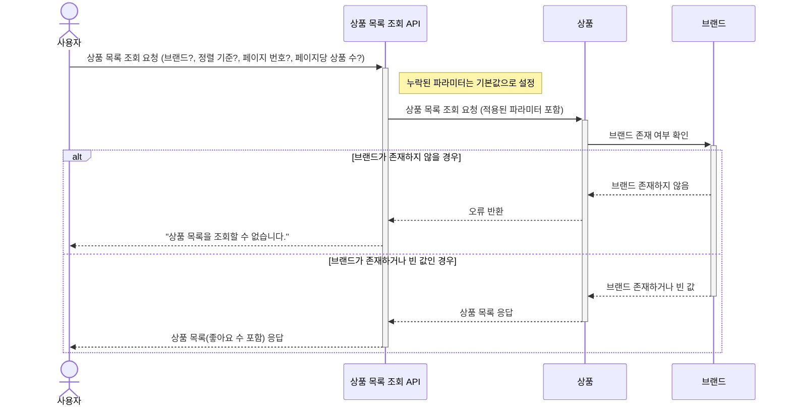
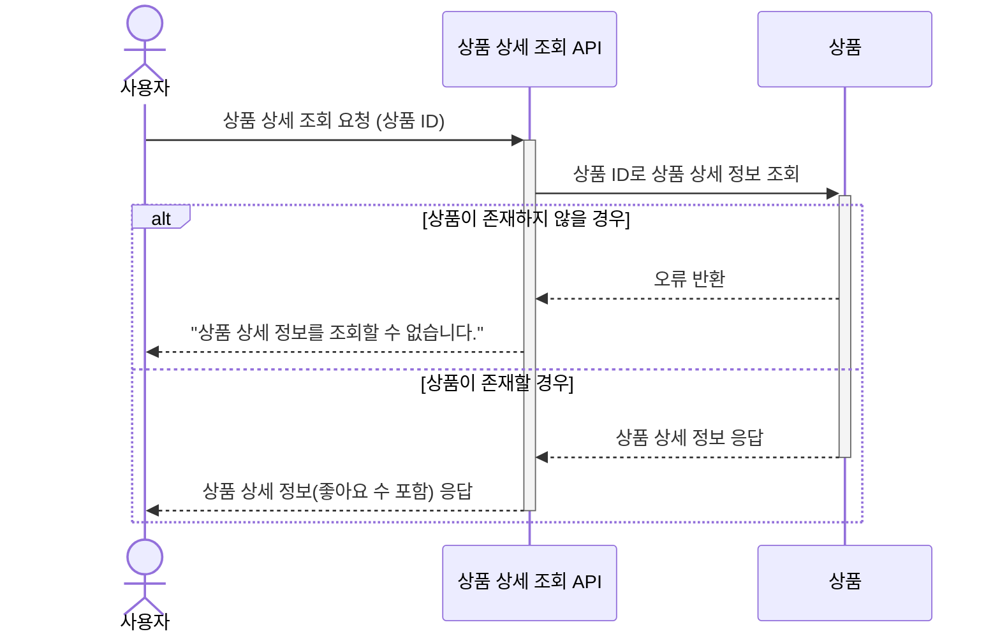
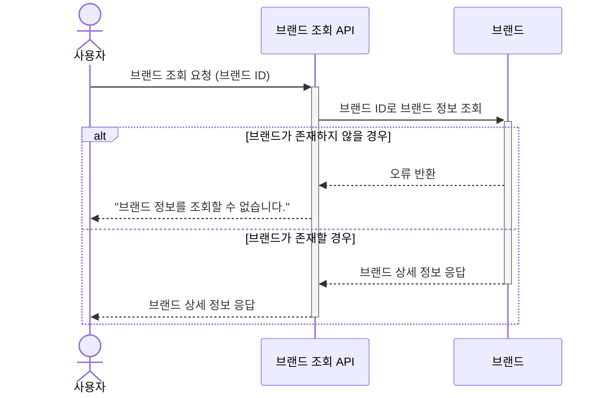
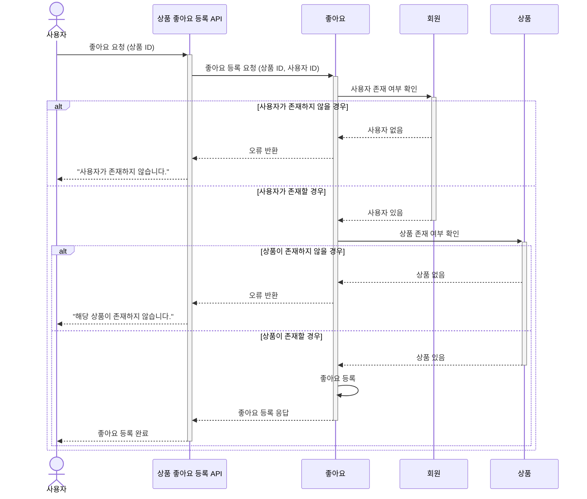
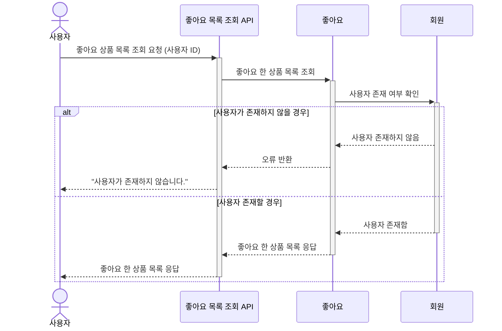
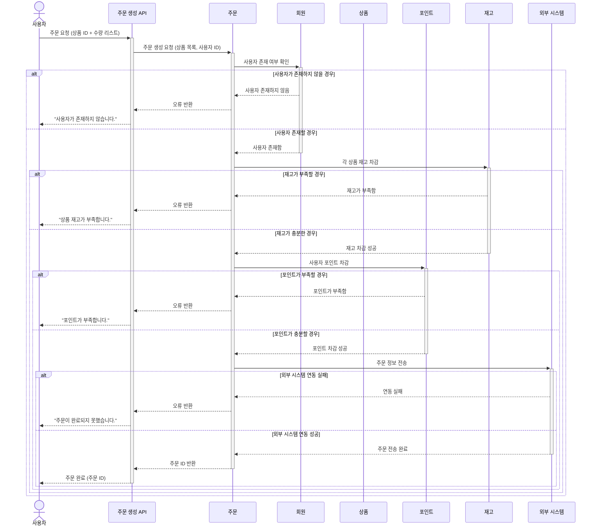
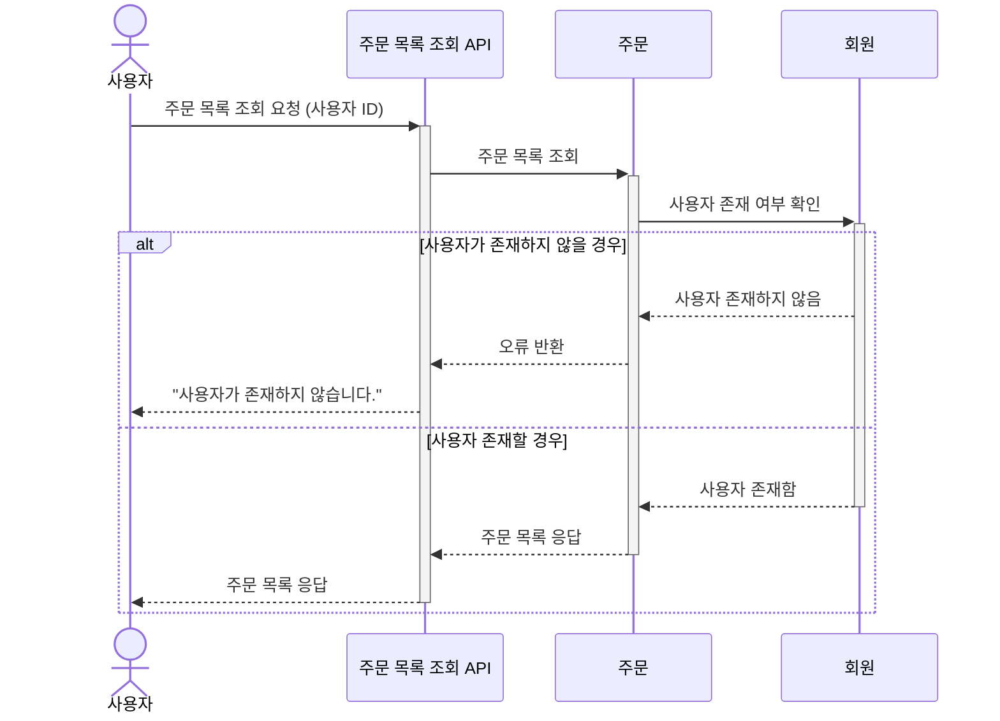
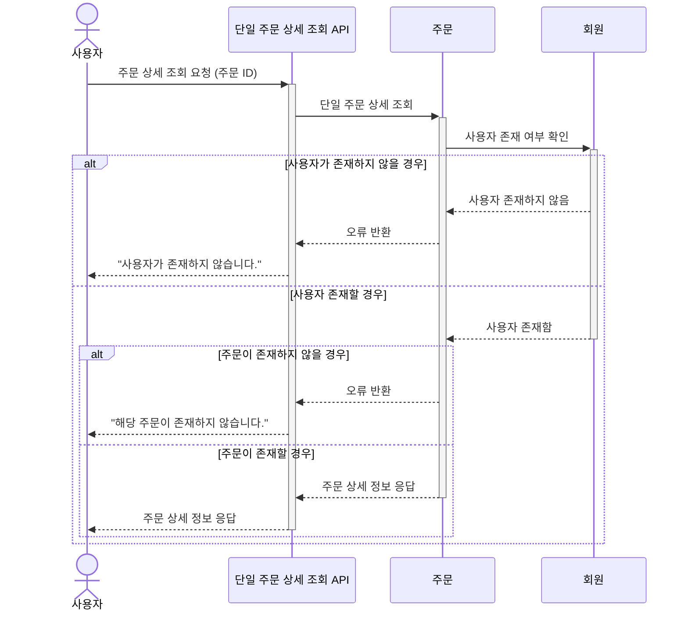

# 시퀀스 다이어그램
##  🛒 상품 목록 조회

## 🎁 상품 상세 조회

## 🏷️ 브랜드 조회

## 🫶 상품 좋아요 등록
- 사용자는 로그인 완료된 상태라고 가정한다.
- 사용자는 **각 상품에 한 번만 좋아요** 를 누를 수 있으며 좋아요 등록 기능은 멱등하게 동작한다.

## 🫶 상품 좋아요 취소
- 사용자는 로그인 완료된 상태라고 가정한다.
- 좋아요 취소 기능은 멱등하게 동작한다.

## 😍 사용자가 좋아요 한 상품 목록 조회
- 사용자는 로그인 완료된 상태라고 가정한다.

## 💳 주문 생성 및 결제
- 사용자는 로그인 완료된 상태라고 가정한다.
- 주문 시 필요한 처리:
  - 상품 재고 확인 및 차감
  - 포인트 확인 및 차감
  - 주문 정보 외부 시스템 전송 **(Mock 처리 가능)**

## 🗂️ 사용자의 주문 목록 조회
- 사용자는 로그인 완료된 상태라고 가정한다.

## 📌 단일 주문 상세 조회
- 사용자는 로그인 완료된 상태라고 가정한다.
