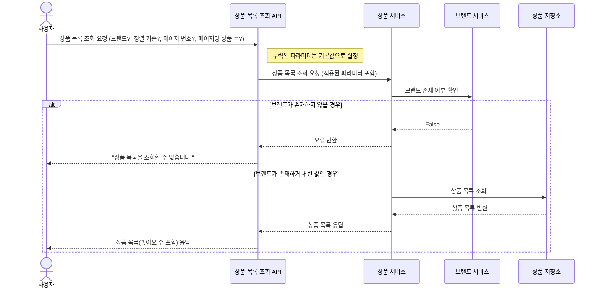
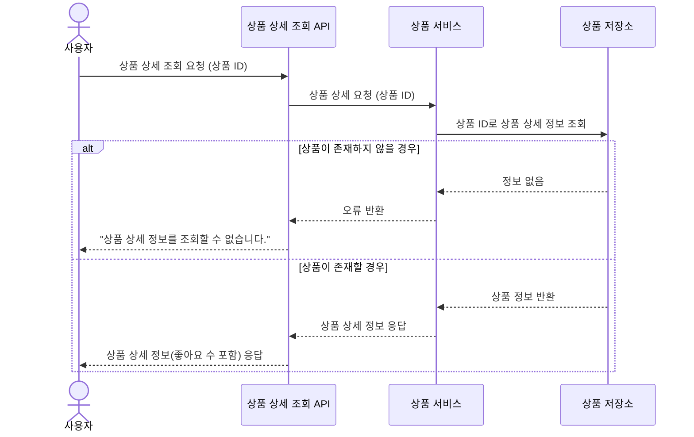
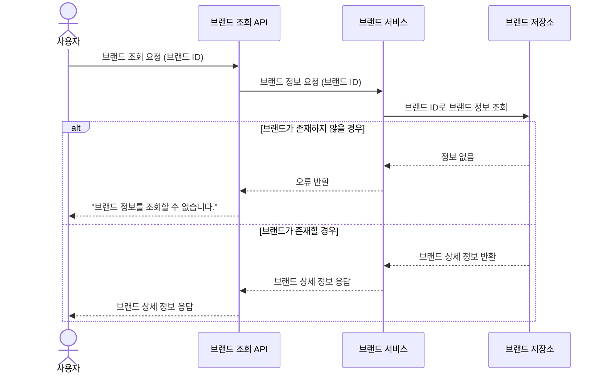

# 시퀀스 다이어그램
##  🛒 상품 목록 조회

```mermaid
sequenceDiagram
    actor 사용자
    participant 상품 목록 조회 API
    participant 상품 서비스
    participant 브랜드 서비스
    participant 상품 저장소

    사용자->>상품 목록 조회 API: 상품 목록 조회 요청 (브랜드?, 정렬 기준?, 페이지 번호?, 페이지당 상품 수?)
    Note right of 상품 목록 조회 API: 누락된 파라미터는 기본값으로 설정

    상품 목록 조회 API->>상품 서비스: 상품 목록 조회 요청 (적용된 파라미터 포함)

    상품 서비스->>브랜드 서비스: 브랜드 존재 여부 확인
    alt 브랜드가 존재하지 않을 경우
        브랜드 서비스-->>상품 서비스: False
        상품 서비스-->>상품 목록 조회 API: 오류 반환
        상품 목록 조회 API-->>사용자: "상품 목록을 조회할 수 없습니다."
    else 브랜드가 존재하거나 빈 값인 경우
        상품 서비스->>상품 저장소: 상품 목록 조회
        상품 저장소-->>상품 서비스: 상품 목록 반환
        상품 서비스-->>상품 목록 조회 API: 상품 목록 응답
        상품 목록 조회 API-->>사용자: 상품 목록(좋아요 수 포함) 응답
    end
```

## 🎁 상품 상세 조회

```mermaid
sequenceDiagram
    actor 사용자
    participant 상품 상세 조회 API
    participant 상품 서비스
    participant 상품 저장소

    사용자->>상품 상세 조회 API: 상품 상세 조회 요청 (상품 ID)
    상품 상세 조회 API->>상품 서비스: 상품 상세 요청 (상품 ID)
    상품 서비스->>상품 저장소: 상품 ID로 상품 상세 정보 조회

    alt 상품이 존재하지 않을 경우
        상품 저장소-->>상품 서비스: 정보 없음
        상품 서비스-->>상품 상세 조회 API: 오류 반환
        상품 상세 조회 API-->>사용자: "상품 상세 정보를 조회할 수 없습니다."
    else 상품이 존재할 경우
        상품 저장소-->>상품 서비스: 상품 정보 반환
        상품 서비스-->>상품 상세 조회 API: 상품 상세 정보 응답
        상품 상세 조회 API-->>사용자: 상품 상세 정보(좋아요 수 포함) 응답
    end
```

## 🏷️ 브랜드 조회

```mermaid
sequenceDiagram
    actor 사용자
    participant 브랜드 조회 API
    participant 브랜드 서비스
    participant 브랜드 저장소

    사용자->>브랜드 조회 API: 브랜드 조회 요청 (브랜드 ID)
    브랜드 조회 API->>브랜드 서비스: 브랜드 정보 요청 (브랜드 ID)
    브랜드 서비스->>브랜드 저장소: 브랜드 ID로 브랜드 정보 조회

    alt 브랜드가 존재하지 않을 경우
        브랜드 저장소-->>브랜드 서비스: 정보 없음
        브랜드 서비스-->>브랜드 조회 API: 오류 반환
        브랜드 조회 API-->>사용자: "브랜드 정보를 조회할 수 없습니다."
    else 브랜드가 존재할 경우
        브랜드 저장소-->>브랜드 서비스: 브랜드 상세 정보 반환
        브랜드 서비스-->>브랜드 조회 API: 브랜드 상세 정보 응답
        브랜드 조회 API-->>사용자: 브랜드 상세 정보 응답
    end
```

## 🫶 상품 좋아요 등록/취소
