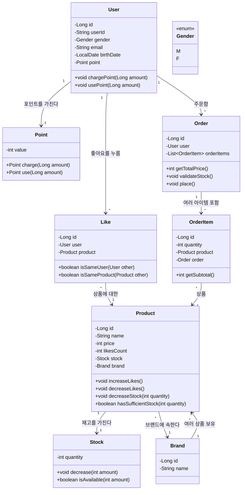

# 클래스 다이어그램
- User, Order, Like, OrderItem, Product, Brand 클래스는 공통적으로 BaseEntity를 상속받는다.
- Point, Stock 클래스는 Value Object(VO)로 동작한다.

```mermaid
classDiagram
class User {
        -Long id
        -String userId
        -Gender gender
        -String email
        -LocalDate birthDate
        -Point point
        
        +void chargePoint(Long amount)
        +void usePoint(Long amount)
    }

    class Point {
        -int value
        
        +Point charge(Long amount)
        +Point use(Long amount)
    }

    class Product {
        -Long id
        -String name
        -int price
        -int likesCount
        -Stock stock
        -Brand brand
        
        +void increaseLikes()
        +void decreaseLikes()
        +void decreaseStock(int quantity)
        +boolean hasSufficientStock(int quantity)
    }

    class Stock {
        -int quantity
        
        +void decrease(int amount)
        +boolean isAvailable(int amount)
    }

    class Brand {
        -Long id
        -String name
    }

    class Like {
        -Long id
        -User user
        -Product product
        
        +boolean isSameUser(User other)
        +boolean isSameProduct(Product other)
    }

    class Order {
        -Long id
        -User user
        -List~OrderItem~ orderItems
        
        +int getTotalPrice()
        +void validateStock()
        +void place()
    }

    class OrderItem {
        -Long id
        -int quantity
        -Product product
        -Order order
        
        +int getSubtotal()
    }

    class Gender {
        <<enum>>
        M
        F
    }

    %% 관계 정의
    User "1" --> "1" Point : 포인트를 가진다
    Product "1" --> "1" Stock : 재고를 가진다
    Product "*" --> "1" Brand : 브랜드에 속한다
    User "1" --> "*" Like : 좋아요를 누름
    User "1" --> "*" Order : 주문함
    Like "*" --> "1" Product : 상품에 대한
    Order "1" --> "*" OrderItem : 여러 아이템 포함
    OrderItem "*" --> "1" Product : 상품
    Brand "1" --> "*" Product : 여러 상품 보유
```