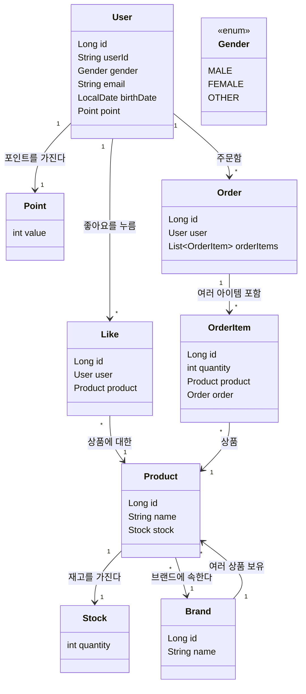

# 클래스 다이어그램

```mermaid
classDiagram
class User {
Long id
String userId
Gender gender
String email
LocalDate birthDate
Point point
}

    class Point {
        int value
    }

    class Product {
        Long id
        String name
        Stock stock
    }

    class Stock {
        int quantity
    }

    class Brand {
        Long id
        String name
    }

    class Like {
        Long id
        User user
        Product product
    }

    class Order {
        Long id
        User user
        List~OrderItem~ orderItems
    }

    class OrderItem {
        Long id
        int quantity
        Product product
        Order order
    }

    class Gender {
        <<enum>>
        MALE
        FEMALE
        OTHER
    }

    %% 관계 정의
    User "1" --> "1" Point : 포인트를 가진다
    Product "1" --> "1" Stock : 재고를 가진다
    Product "*" --> "1" Brand : 브랜드에 속한다
    User "1" --> "*" Like : 좋아요를 누름
    User "1" --> "*" Order : 주문함
    Like "*" --> "1" Product : 상품에 대한
    Order "1" --> "*" OrderItem : 여러 아이템 포함
    OrderItem "*" --> "1" Product : 상품
    Brand "1" --> "*" Product : 여러 상품 보유
```