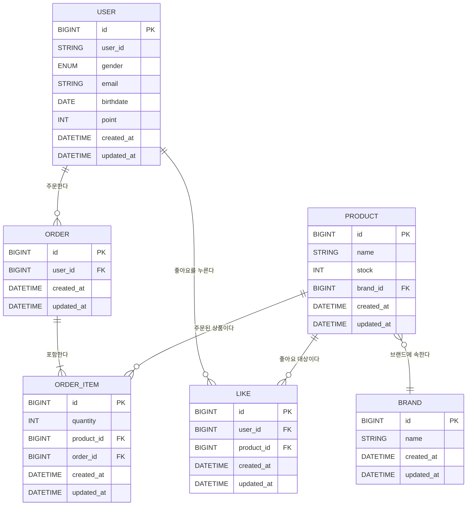

# ERD
## ✅ ERD 설명
- 모든 테이블은 created_at, updated_at 컬럼을 가지고 있으며, BaseEntity로부터 상속된다.
- point, stock은 각각 User, Product 객체에 임베디드된 값 객체(VO)로 구성되므로 별도 테이블로 분리하지 않고, 단일 필드로 관리한다.

## ✅ 주요 테이블 설명
### 🔹 USER
- 사용자 정보를 저장하는 테이블
- `user_id`는 로그인 시 사용하는 ID
- `point`는 사용자의 현재 포인트를 의미하며 단일 필드로 관리된다.
### 🔹 PRODUCT
- 판매 중인 상품 정보를 담는 테이블
- `stock`은 재고 수량을 나타내며 단순 수치만 관리한다.
- 하나의 상품은 하나의 브랜드에 속한다.
### 🔹 BRAND
- 상품 브랜드 정보를 관리하는 테이블
- 하나의 브랜드에 여러 개의 상품이 속할 수 있다.
### 🔹 LIKE
- 사용자가 특정 상품에 대해 좋아요를 누른 이력을 저장한다.
- 사용자와 상품의 조합은 **한 번만** 등록될 수 있다.
### 🔹 ORDER
- 주문 마스터 테이블로 하나의 주문은 여러 개의 상품을 포함할 수 있다.
- 주문 단위로 묶이는 정보를 담고 실제 주문 아이템은 `ORDER_ITEM`에 존재한다.
### 🔹 ORDER_ITEM
- 주문에 포함된 각각의 상품 항목을 나타낸다. 
- `quantity`는 주문 수량
- `product_id`는 어떤 상품이 주문 되었는지를 나타낸다.
- `order_id`로 상위 주문과 연결 된다.